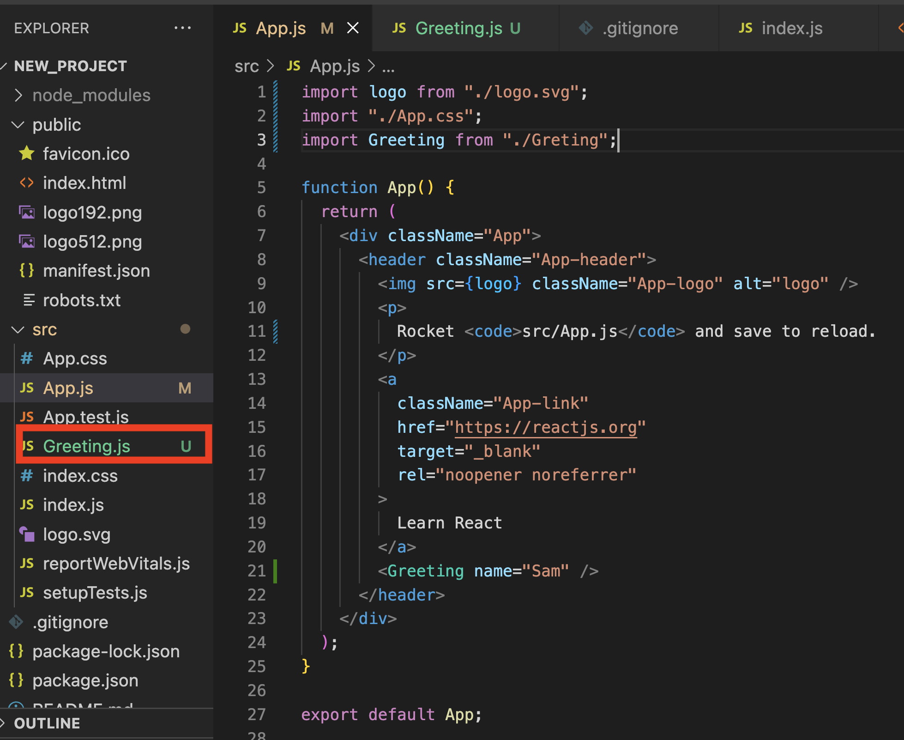

# Course Methodology

## Flipped Classroom

Rocket adopts a flipped-classroom model where Rocket expects students to review lectures and course materials before class, and spend class time clarifying concepts and completing exercises with the guidance of a section leader.

## How to unblock yourself

### General tips

Rocket recommends the following 3 steps to unblock ourselves when blocked on a problem.

1. Trace the error message. What could be causing this error message? If we address that and there is another error message, keep addressing until there are no more error messages. If you do not see an error message, find where it is and/or find a way to give yourself more clues, e.g. with `console.log` statements.
2. Google the error message and context, e.g. "PropTypes not defined React". Skim through Google results and dig deeper in results that seem more promising.
3. Ask your peers and section leader in your section Slack channel, sharing context about the problem and what you've learnt from Steps 1 and 2 above. Context will allow them to help you. Rocket mostly uses mainstream technologies and our problems will not be overly difficult.

### How to use Google

Students will need to use Google as a resource to solve problems not explained in Rocket's curriculum. Rocket will do our best to document the most common mistakes, but it would be impossible to document all. Professional SWEs spend most time finding answers on Google, and googling effectively may be your most important takeaway from Bootcamp.

When searching on Google, generally search for a combination of your error message and relevant technology name. For example, "Uncaught TypeError: Cannot read properties of null JavaScript" (JavaScript is the technology in this example). This will allow Google to share results for the specific error we are seeing for the specific technology.

With experience you will know when you are on the right track. Often it takes multiple permutations of Google search keywords to find the answer we are looking for. The goal when reading documentation, Stack Overflow or forum answers is to find relevant information as quickly as possible without reading more than necessary.

### How to ask questions to get help

Always provide context with questions. Helpful context for technical questions can include:

1. What is the error message?
2. What do you think is the problem?
3. What have you learnt from debugging and googling?
4. What is the relevant code causing the problem?

Compare the following 3 questions. Notice how it becomes much easier to help someone the more context we have about their problem.

#### Question 1: No context

> "My code is not working. Please help!"

#### Question 2: Incomplete context

> "My code is not working. I'm getting the error "Uncaught TypeError: Cannot read properties of null (reading 'rank')". Please help!"

#### Question 3: Full context

> "I'm getting the error 'Uncaught TypeError: Cannot read properties of null (reading 'rank')' on line 3. On line 3 I'm accessing a property of object `card` from my card deck. Googling tells me that `card` must be `null`, but I am not sure why. I've attached the relevant code below. Any suggestions?"
>
> ```javascript
> const cardDeck = [null];
> const card = cardDeck[0];
> console.log(card.rank);
> ```


### **How to document your errors**

In this section, we will be looking at how we can document errors, this will facilitate your debugging process and make asking for help much easier.

### Frontend React Error

When handling errors in a React frontend, you can usually see an error message in the Command Line Interface where you executed the command ‘npm start’, as well as the console of the browser. The browser usually emulates the error that is found in the Command Line Interface, so the Terminal, for Mac, or Ubuntu for Windows, is where one starts debugging. Let’s take a look at an application that is currently experiencing an error.

**To document a React error to the fullest, find the errors in your Command Line Interface, take some screenshots and provide these screenshots when asking for help.**&#x20;

<figure><figcaption><p>React terminal error</p></figcaption></figure>

The error found in the CLI specifies that there is an issue:

`‘Module not found: Error: Can’t resolve ‘./Greting’ …  ERROR in ./src/App.js 6:0-33’`&#x20;

This means that something that we are importing within the App.js cannot be found, the file which we are importing from seems to be ‘./Greting’.


<figure><figcaption><p>Browser error</p></figcaption></figure>

The error that we would see in the browser mirrors what we have looked at previously, this is because React is showcasing the errors that occurred during runtime. This means we probably need to take a look into the App.js as React’s error reporting is telling us where the issue originates.&#x20;

#### Further documenting && Solving the Error

<figure><figcaption><p><br>Failing App.js</p></figcaption></figure>

From the code block here we can see that the component is importing ‘./Greting.js’, but if we look at the image, on the left,  we can see that the  file name is called Greeting.js. So to fix this problem, we just need to fix the import statement, such that we were importing from the correct file, then the error should be fixed.

So when we are documenting this error we should share error screenshots of the CLI tool running the application, the browser errors as well as the JavaScript components or files that are being flagged by React. In this case, the App.js.


### Document Backend Errors

When developing a backend server, it might seem operational, however, when an actual API route is consumed an error is thrown  in your CLI window where the backend application is running. This issue that is occurring might stem from the route handler, the Controller or even database. So what we will have to do is breakdown the error and and see if that can solve the issue.

To do this we would need to share the error that is being shown within our backend CLI, an example is below.

<figure><figcaption><p>CLI Error</p></figcaption></figure>

In the error above, we can see that it reads:

`‘ConnectionRefusedError … connect ECONNREFUSED 127.0.0.1:5432”`

By reading the error we can ascertain the where the issue is seeming from, in this case it seems like a Seqeulize issue has occurred, specifically that the client (our server) cannot connect to our database. There is a simple solution to this error, turn on your database. It’s possible to forget to start your database server locally or even on a deployed instance, when developing always remember to check your environments are setup before testing.\


You should always over share when trying to debug as it will help to provide context to people attempting to help you.


Here is an example of another error:

<figure><figcaption><p>Database Issue</p></figcaption></figure>

There are a few things that you should look out for when you are debugging your applications, some of them are highlighted above, we can see that the error is being thrown by Seqeulize, the error reads:

`‘error: relation “sightings” does not exist’`&#x20;

The error code is ’42P01’, a quick google indicates that, our database, PostgreSQL, states that error 42P01 **denotes the database query is on an undefined table**. This error usually occurs due to improper database setup, unidentified table name.

But how could this be? You’ve already setup the database, you have run npx sequelize db:migrate as well as the seed commands. So how when, I am consuming an API does it error out? Consider how Sequelize sets up your database, it will use the credentials found in ‘/config/database.js’, for database creation, migration as well as seeding data. On the other hand when querying data programatically from the application it will take whatever credentials that you have placed into the ‘/models/index.js’. Use console.log statements to ensure that your are using the correct credentials when you query data.&#x20;


The issues above were database related. You may encounter issues with other parts of your backend, such as your Controller or Router. If you do encounter an issue it would be prudent to share all of the affected files.&#x20;

Say you are trying to get some data from your database and display it on your backend, but you're receiving an error like this:

<figure><figcaption><p>Backend Error, Controller</p></figcaption></figure>

This error seems to stem from the baseController file as highlighted by the image above, in this case, it would be prudent to share this file if you are asking for help. &#x20;

<figure><figcaption><p>BaseController.js</p></figcaption></figure>

The error reads:

`'TypeError: Cannot read properties of undefined (reading 'findAll')'`

This indicates that there is an issue with the findAll command, in this case, we have spelt model incorrectly, replace with `this.model` and the code should be operational.


**Debugging CheckList**

* [ ] &#x20;**** Find any error codes&#x20;
* [ ] Document your error codes and environments they occur in
* [ ] Google the error codes to find a fix
* [ ] Check all of your environment is setup correctly
* [ ] Check that your environmental variables are correct
* [ ] Check casing throughout your application
* [ ] Check your dependancy injections
* [ ] Checkout your git commits to find a working version of your code
* [ ] Remove code line by line to check where the bug is
* [ ] Rebuild the application one line at a time checking to see if its broken


## Difficulty Levels

Rocket provides multiple levels of difficulty to accommodate different learning speeds and prior experience. Students can complete Bootcamp without attempting Comfortable, but students that complete Comfortable may have a firmer grasp of concepts. Rocket recommends completing Base for all of each day's post-class and pre-class exercises before attempting Comfortable.

### Base

Bare minimum. All students must complete Base to understand concepts.

### Comfortable

Reinforce with further exercises around same concepts. For students that wish to deepen understanding of current concepts before moving onto new ones.

### More Comfortable

Deepest exercises that Rocket offers for each concept. For students that wish to push the limits of their understanding of the current concepts.

## Project Methodology

### Ideation Phase 1

Brainstorm app ideas and solicit feedback from your section in Slack. What problem does the app solve, for whom? How does the app solve the problem? What data does the app handle? Feel free to use [Rocket's project planning template](https://docs.google.com/document/d/1klyi92bVHUKjxgD\_Saou\_u6yoEZFbzkvbttj2izh8xg/edit?usp=sharing) to guide you.

### Ideation Phase 2

Create the following planning docs, save them in the project GitHub repo and share them with your section in Slack for feedback. Your SL will review your planning docs with you before you begin implementation.

#### All Projects

1. User stories
2. Wireframes
3. Kanban board

#### Project 2 Onward

1. DB schema outline (NoSQL) or DB ERD (SQL)

### Scrum

Professional tech teams typically run using [Agile Scrum Methodology](https://www.atlassian.com/agile/scrum). Rocket simulates this during Bootcamp project weeks. Each course day students will share the following with their section to keep each other on track.

1. What did you do between the previous course day and today?
2. What do you plan to do between today and the next course day?
3. Do you have any blockers?

### Presentations

Students present projects in class on the last day of each module. Presentations should cover the following.

1. App demo
2. App development strategy
3. Biggest challenges faced
4. What you might do differently next time

### Post-Mortem

After each project your section leader will review your code with you 1-1. Please prepare answers to below questions before meeting. Consider recording notes; past students have found post-mortem notes helpful for resumes and portfolios.

Consider questions from both a technical and process perspective.

1. What went well? Please share a link to the specific code.
2. What were the biggest challenges you faced? Please share a link to the specific code.
3. What would you do differently next time?

### Demo Video

Record a video after each project to showcase your hard work for your portfolio and employers.

#### Requirements

1. Demo your app in a 1-2 minute video (brevity is best!)
2. Explain who your app is for, what their problem is and how they would solve their problem with your app
3. Use language that non-technical recruiters would understand
4. Record locally with Zoom with your face in the upper-right corner. Upload to YouTube and embed a video link in your project `README`.

#### Past Examples

These batches did not have a time limit; please keep yours under 2 minutes if possible.

1. [Porter (FTBC3)](https://www.youtube.com/watch?v=466AbXvMdzc)
2. [Ian (FTBC2)](https://www.youtube.com/watch?v=JjHM96XIXjs)
3. [Jit Corn (FTBC1)](https://www.youtube.com/watch?v=RxihjXRp7cQ)

## Sharing Code with Classmates

In software engineering, there are so many different ways to solve the same problem. One great way to maximise learning to have a look at how your friends completed the same exercises!

### Part 1: Sharing your solution

1. To start off any project, you will have to go to the starter repo and fork the repo.
2. Next, you will go to this new forked repo and `git clone` it down to your filesystem.
3. You are now ready to go work on your project and make all the required changes.
4. It'll be great to include a `README.md` that includes
   1. A brief description of your app
   2. How to setup and run your app
   3. For example, see [https://github.com/jiachen247/bootcamp/tree/master/M3/3-ICE-1/bigfoot-express-bootcamp](https://github.com/jiachen247/bootcamp/tree/master/M3/3-ICE-1/bigfoot-express-bootcamp)
5. Once done, you can go on to commit and push the files as per usual
   1. `git add .`
   2. `git commit -m "insert commit message here"`
   3. `git push`
6. Once the push is successfully, you should see it on your forked repo on Github.
7. Go on to make a Pull Request (from your forked repo to the original starter repo)
   1. Please name the PR "\<Your name> \<Bootcamp batch>" eg. "Jiachen FTBC6"

### Part 2: Checking out your classmates' solutions

1. To view your classmates' solutions, you can go to the starter repo and click the Pull Request (PR) tab.
2. Next, you search for your bootcamp batch (eg. FTBC6) and all your classmates PRs should be listed there.
   1. For example, see [https://github.com/rocketacademy/html-noodles-bootcamp/pulls?q=is%3Apr+is%3Aopen+FTBC6](https://github.com/rocketacademy/html-noodles-bootcamp/pulls?q=is%3Apr+is%3Aopen+FTBC6)
3. You can then view their code under the File Changes tab in the PR to view all the changes they have made.
4. To run and build their project locally, you can click on their forked repo in the PR and `git clone` it down as usual to run the project.
5. Once cloned, you can follow the README to setup and run the app!

## Peer Code Review

Occasionally we will review each others' code to learn from each other. Start by reviewing your partner's code individually, before discussing the review in pairs.

### Part 1: Individual

1. Clone partner's code
2. Read partner's code
   1. How does it work?
   2. How is it different from my implementation?
   3. What can I learn from this?
3. Run partner's code
   1. If you're not sure how certain code might behave, run it. Feel free to edit the code to verify your understanding.
4. Complete code review on partner's GitHub pull request to help them improve

### Part 2: In Pairs

1. Review learnings from individual code reviews
2. Pair program on 1 person's code to get a working version. The person with the weaker understanding of the current concepts should be the driver. For more info on pair programming, read [Rocket's primer on pair programming in Coding Basics](https://basics.rocketacademy.co/course-logistics/course-methodology/course-components#pair-programming).
